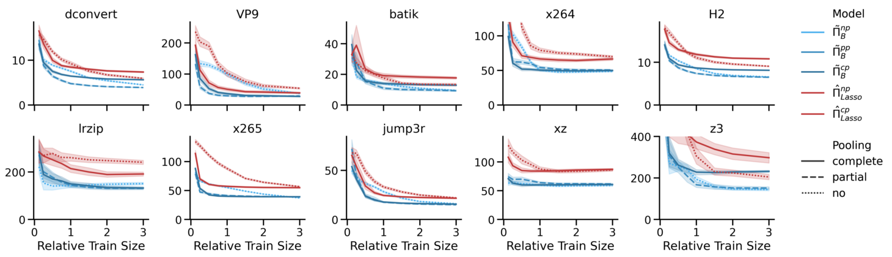
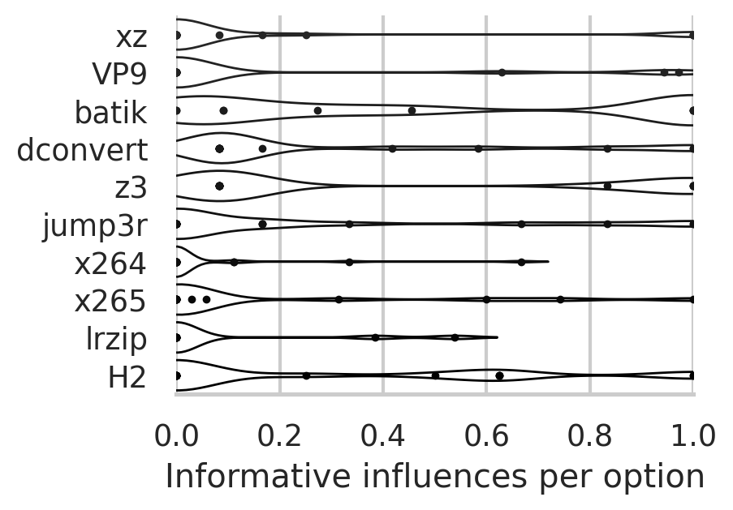
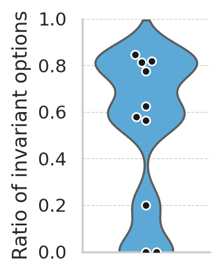

# README

This repository provides additional content for the paper "Bayesian Multi-Level Performance Models for Multi-Factor
Variability of Configurable Software Systems"

## Paper

PDF: will be linked later

## ABSTRACT</h3>

Configuring a software system for a specific environment and use case is challenging. Beyond functionality,
configuration options may have a substantial influence on performance. Due to combinatorics, it is often unclear in
practice *how* to configure a system to yield certain performance guarantees. Multiple factors, such as varying the
workload, may affect the influence of configuration options on performance substantially as recent studies have shown.
There are two principal approaches in the literature to address this *multi-factor variance*: (1) measure a subset of
configurations for varying environments to learn a single model or (2) learn a distinct model for every single
environment of the system.

We introduce a third approach to this mix: *Bayesian Multi-level models*, called HyPerf. The key idea of HyPerf is to
explicitly model the uncertainty in performance influences of configuration options arising from the sparsity of
training data considering the vast space of possible environments and measurement noise. Capturing common patterns in
so-called *hyper priors* in a superior model level, HyPerf generalizes performance influences across multiple factors.
Through a large-scale empirical analysis, we assess the prediction accuracy of all three approaches on 10 real-world
subject systems across up to 35 environments. Our findings demonstrate HyPerf’s competitive predictive performance among
interpretable models. Further variance analysis using HyPerf reveals the prevalence of workload dependency of option's
performance influences. We show that, for most software systems, several workloads are necessary to capture most of the
intra-environmental variance.

## Supplementary Material
 
[//]: # (  <details>)

[//]: # (    <summary><h3>Software Systems</h3></summary>)

[//]: # ()

[//]: # (  </details>)
  <details>
    <summary><h3>RQ1</h3></summary>

[](supplementary-material/RQ1/rq1-results.pdf)

You can view the pMAPE values in [the respective sub-folder](supplementary-material/RQ1/).

  </details>
  <details>
    <summary><h3>RQ2</h3></summary>

[](supplementary-material/RQ2/rq2-informativeness-per-option.pdf)
[](supplementary-material/RQ2/rq2-ratio-of-informative-options.pdf)

Extending Figure 3 in the paper, you can compare all general influences against their workload-specific influences by
navigating [the respective sub-folder](supplementary-material/RQ2).

  </details>
  <details>
    <summary><h3>RQ3</h3></summary>


Extending Figure 5 in the paper, you can view all representation matrices for all options by
navigating [the respective "representation-matrices" subfolder for each software system](supplementary-material/RQ3).

Extending Figure 6 in the paper, you can view all representative set building protocols and plots by
navigating [the root subfolders for each software system](supplementary-material/RQ3).

Example for Z3:

[](supplementary-material/RQ3/z3/rq3-set-building-z3.pdf)


  </details>
<details open>
  <summary><h2>Replication Package</h2></summary>
   <h3>Experiment Parameters</h3>

  For running the experiments with any of the ways explained below, there are different parameters to be adjusted:
  - `--jobs` defines how many models are trained in parallel. Increasing it reduces the total run time without altering the results. Each job employs 3 MCMC chains, resulting in 3 required threads per job. E.g., for 6 available threads, choose `--jobs 2`.
  - `--store` should only be used if insights into posterior distributions are needed, e.g., when replicating the paper's plots through the provided dashboards.
  - `--reps` defines the number of repetitions. While the paper used 30 repetitions, we recommend reducing to 1 to check if everything works.
  - `--training-set-size` disables the sweep over different training set sizes and, instead, only uses the given size. Passing 0.5 will train on 0.5N training data for all software systems listed in the main.py.
  - To replicate the RQs in the paper, use the commands for running the docker container as outlined below.

[//]: # (     - To replicate RQ1, use the rq1 command running the docker choose `--reps 30` and do not set the `--store` flag because it will likeliy fill up the hard disk.)

[//]: # (     - To replicate RQ2 and RQ3, choose `--reps 1 --store --training-set-size 3`, as posterior distributions must be stored, while only models the first random seed `0` were analyzed.)


<details>
    <summary><h3>Run as Docker (Replication)</h3></summary>
    To run the full experiment via Docker, follow these steps:

1. **Install Docker:**
    - Refer to the [Docker Documentation](https://docs.docker.com/) for installation instructions.

2. **Clone the Repository:**
    - Navigate to the directory where you want to clone the repository and run:

   ```sh
   git clone https://github.com/anonym458551495/multilvl-models-multi-factor-variab
   cd path-of-repo/multilvl-models-multi-factor-variab/experiment-code
   ```
3. **Build the Docker Image:**
    - Open a terminal.
    - Change your directory to `path-of-repo/multilvl-models-multi-factor-variab/experiment-code`.
    - Run the following command:
      ```sh
      docker build ./ -t hyperf/repl
      ```

4. **Run RQ1 with the Docker Container:**
    - After the build is complete, run your Docker container with:
      ```sh
      docker run -p 8083:8083 --name hyperf-rq1 hyperf/repl rq1 --reps 5 --jobs 5
      ```
        - Adjust the number of jobs to your CPU; five repetitions should suffice to see robust trends, but do choose 30
          to replicate the paper's experiment
    - When the job is *finished*, explore the Streamlit dashboard at http://localhost:8083. You can change the port by
      replacing the port before the colon, i.e., `OUTERPORT:8083`.
    - To copy the results outside the docker use:
      ```sh
      docker cp hyperf-rq1:/app/wluncert/results /local/path
      docker rm temp-container
      ```

4. **Run RQ2 and RQ3 with the Docker Container:**
    - After the build is complete, run your Docker container with:
      ```sh
      docker run -p 8084:8084 --name hyperf-rq2-and-3 hyperf/repl rq23 --jobs 5
      ```
        - Adjust the number of jobs to your hardware; calling the rq23 command automatically only runs 1 repetition

    - Explore the Streamlit dashboard at http://localhost:8084.
    - To copy the results outside the docker use:
      ```sh
      docker cp hyperf-rq2-and-3:/app/wluncert/results /local/path
      docker rm temp-container
      ```


4. **Run custom experiments with the Docker Container:**
    - To set own parameters, use the custom-experiment command or start a bash in the new container:
      ```sh
      docker run -p 8083:8083 -p 8084:8084 --name hyperf-custom-experiment hyperf/repl custom-experiment --jobs 5 --training-set-size 5
      ```
      or
      ```sh
      docker run -it -p 8083:8083 -p 8084:8084 --name hyperf-custom-session --entrypoint bash hyperf/repl  
      ```

  </details>

[//]: # (  <details>)

[//]: # (    <summary><h3>Running the Experiment Locally Without Docker &#40;Replication&#41;</h3></summary>)


[//]: # (This guide will help you set up and run the experiment locally on your machine without using Docker. Follow the steps below to get everything up and running.)

[//]: # ()

[//]: # (#### Prerequisites)

[//]: # ()

[//]: # (Ensure you have the following installed on your system:)

[//]: # (- Ubuntu 22.04 or equivalent Linux distribution)

[//]: # (- Python 3.9)

[//]: # (- Git)

[//]: # ()

[//]: # (#### Step-by-Step Instructions)

[//]: # ()

[//]: # (1. **Install Common Software:**)

[//]: # ()

[//]: # (   Open a terminal and run the following commands to update your package list and install the necessary software:)

[//]: # ()

[//]: # (   ```sh)

[//]: # (   sudo apt-get update)

[//]: # (   sudo apt-get install -y software-properties-common git)

[//]: # (   ```)

[//]: # ()

[//]: # (2. **Set Up the Environment:**)

[//]: # ()

[//]: # (   Add the necessary repository and install Python 3.9 along with development tools:)

[//]: # ()

[//]: # (   ```sh)

[//]: # (   sudo add-apt-repository ppa:deadsnakes/ppa)

[//]: # (   sudo apt-get update)

[//]: # (   sudo apt-get install -y python3.9 python3.9-dev python3-pip python3-wheel build-essential python3-distutils python3.9-distutils)

[//]: # (   ```)

[//]: # ()

[//]: # (3. **Clone the Repository:**)

[//]: # ()

[//]: # (   Navigate to the directory where you want to clone the repository and run:)

[//]: # ()

[//]: # (   ```sh)

[//]: # (   git clone https://github.com/anonym458551495/multilvl-models-multi-factor-variab)

[//]: # (   cd path-of-repo/multilvl-models-multi-factor-variab/experiment-code)

[//]: # (   ```)

[//]: # ()

[//]: # (4. **Install Python Dependencies:**)

[//]: # ()

[//]: # (   Use pip to install the required Python packages:)

[//]: # ()

[//]: # (   ```sh)

[//]: # (   python3.9 -m pip install --no-cache-dir -r requirements.txt)

[//]: # (   ```)

[//]: # ()

[//]: # (   Reinstall specific versions of JAX and JAXLIB to avoid version conflicts:)

[//]: # ()

[//]: # (   ```sh)

[//]: # (   python3.9 -m pip install jax==0.4.14 jaxlib==0.4.13)

[//]: # (   ```)

[//]: # ()

[//]: # (5. **Run the Experiment:**)

[//]: # ()

[//]: # (   Change directory to `wluncert` and execute the experiment:)

[//]: # ()

[//]: # (   ```sh)

[//]: # (   cd wluncert)

[//]: # (   python3.9 main.py --experiment multitask --jobs 1 --reps 1 --store)

[//]: # (   ```)

[//]: # (   Here, `--jobs` defines how many models are trained in parallel. Each jobs employs 3 MCMC chains, resulting in 3 required threads per job.)

[//]: # (   The `--store` option should only be used if insights into posterior distributions are needed, e.g., when replicating the paper's plots through the provided dashboards.)

[//]: # (   While the paper used 30 replications, we recommend reducing `--reps` to 1 to check if everything works. Only a single replication is also necessary to replicate model insights for RQ2 and RQ3.)

[//]: # ()

[//]: # (6. **Run the Analysis:**)

[//]: # ()

[//]: # (   After the experiment completes, run the dashboard that aggregates accuracy and cost metrics:)

[//]: # (   )

[//]: # (   ```sh)

[//]: # (   python3.9 modelinsights.py)

[//]: # (   ```)

[//]: # ()

[//]: # (7. **Start the Streamlit Dashboard:**)

[//]: # ()

[//]: # (   Finally, start the Streamlit dashboard to visualize the metrics:)

[//]: # (   ```sh)

[//]: # (   streamlit run playground/metricsdashboard.py)

[//]: # (   ```)

[//]: # ()

[//]: # (If the experiment was run with the `--store` flag, the dashboard for RQ2 and 3 can be executed:)

[//]: # (   ```sh)

[//]: # (   streamlit run playground/insights-dashboard.py)

[//]: # (   ```)

[//]: # ()

[//]: # (#### Summary)

[//]: # ()

[//]: # (By following these steps, you should be able to set up and run the experiment locally on your machine without the need for Docker. This setup replicates the environment and steps defined in the Dockerfile.)

[//]: # ()

[//]: # (#### Troubleshooting)

[//]: # ()

[//]: # (If you encounter any issues:)

[//]: # (- Ensure all dependencies are correctly installed.)

[//]: # (- Check for typos or errors in the commands.)


[//]: # (  </details>)
<details>
    <summary><h3>Changes for Reproduction</h3></summary>
To change the software systems, the easiest way is to bring the data from your new software system into the same format as one of the existing software systems. You can find the data in [Training-Data](/experiment-code/wluncert/training-data).

After that, you need to modify `main.py` in the [wluncert](/experiment-code/wluncert/) directory:

- Add your software system's name to the `selected-data` list (line 216).
- Add your software system to the `get_datasets` function (line 511) using the `DataAdapter` from the software system with the same data format.
  </details>

</details>

